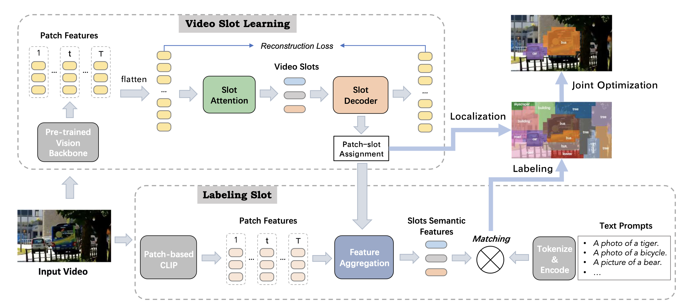

# Unsupervised Open-Vocabulary Object Localization in Videos

This codebase is the official implementation of [Unsupervised Open-Vocabulary Object Localization in Videos](https://openaccess.thecvf.com/content/ICCV2023/html/Fan_Unsupervised_Open-Vocabulary_Object_Localization_in_Videos_ICCV_2023_paper.html).

Arxiv Version:[Link](https://arxiv.org/abs/2309.09858)


## Introduction

We propose an unsupervised video object localization method that first localizes objects in videos via a slot attention approach and then assigns text to the obtained slots. The latter is achieved by an unsupervised way to read localized semantic information from the pre-trained CLIP model. The resulting video object localization is entirely unsupervised apart from the implicit annotation contained in CLIP. 

## Code
We release the codes and checkpoints of Object-Centric VOL here: https://github.com/amazon-science/object-centric-vol


## Citation
If you find our paper useful for your research and applications, please cite using this BibTeX:
```bibtex
@InProceedings{Fan_2023_ICCV,
    author    = {Fan, Ke and Bai, Zechen and Xiao, Tianjun and Zietlow, Dominik and Horn, Max and Zhao, Zixu and Simon-Gabriel, Carl-Johann and Shou, Mike Zheng and Locatello, Francesco and Schiele, Bernt and Brox, Thomas and Zhang, Zheng and Fu, Yanwei and He, Tong},
    title     = {Unsupervised Open-Vocabulary Object Localization in Videos},
    booktitle = {Proceedings of the IEEE/CVF International Conference on Computer Vision (ICCV)},
    month     = {October},
    year      = {2023},
    pages     = {13747-13755}
}
```